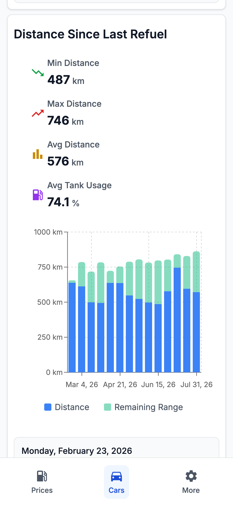
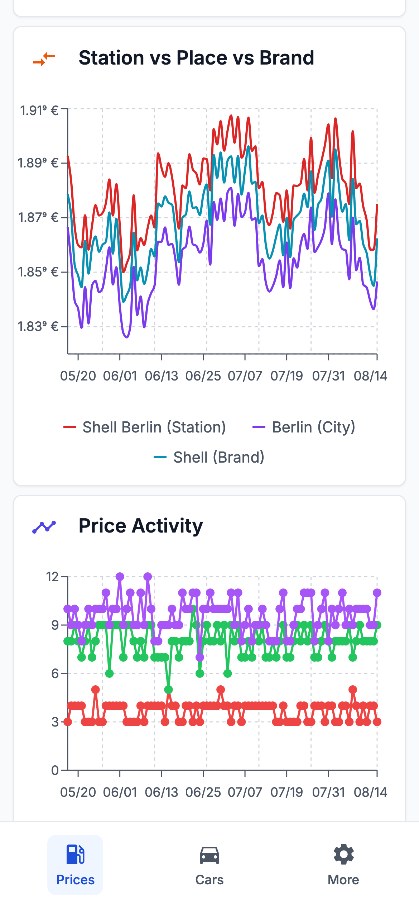
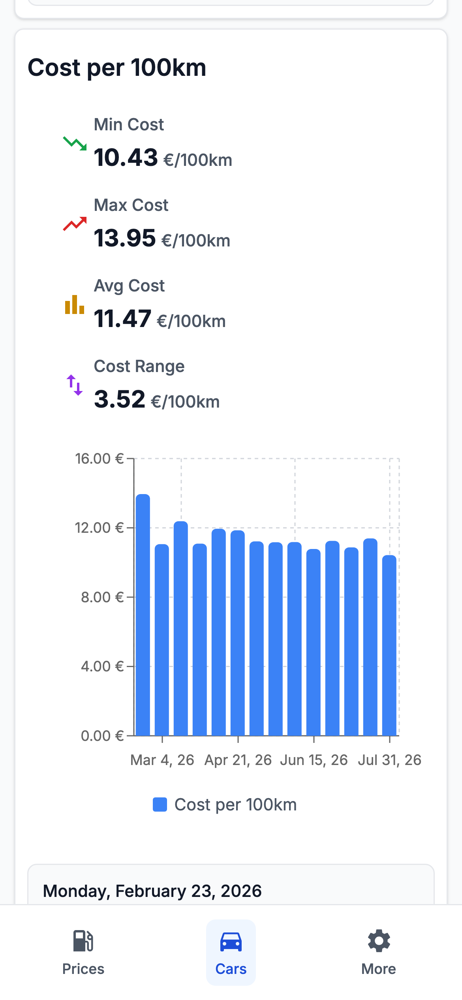
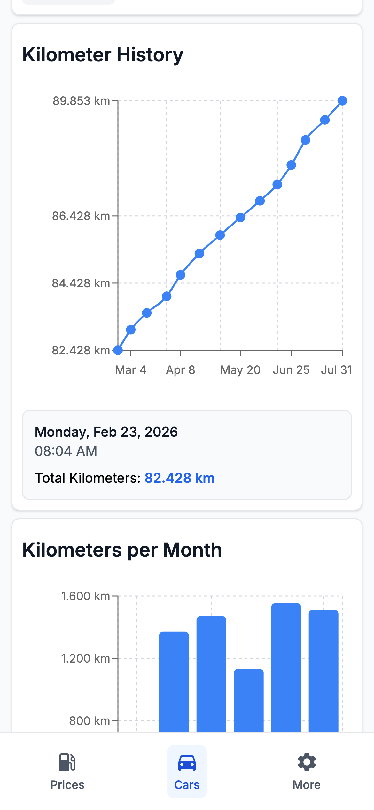
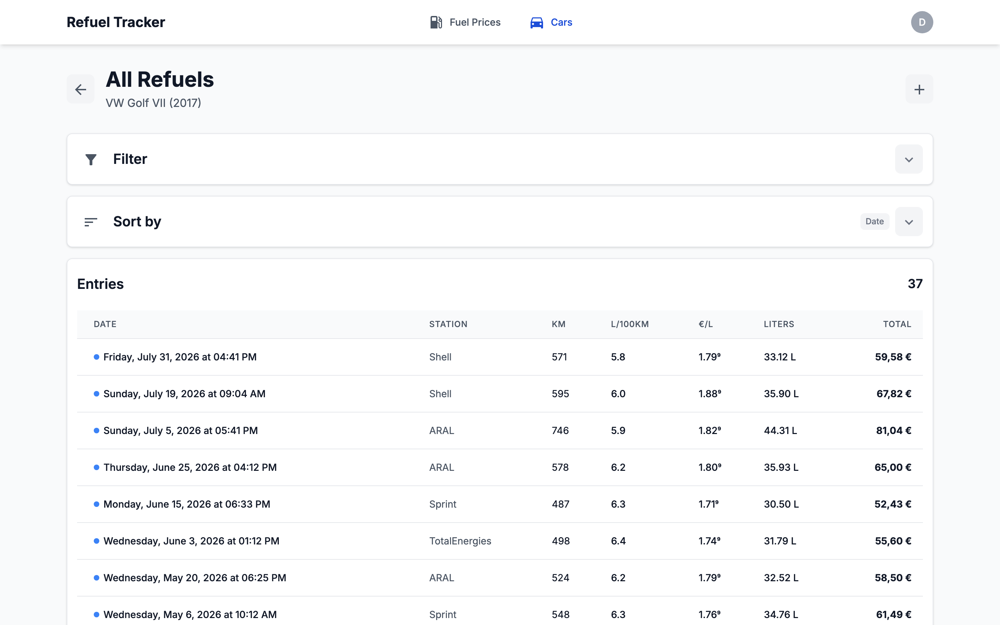

# ⛽ Refuel Tracker

**Know what you really pay for driving.**

Refuel Tracker is a small, self-hosted app that logs every fill-up, tracks your
cars' mileage and keeps an eye on German fuel prices — so you can stop guessing
where and when to refuel.

Fuel prices come from the [Tankerkönig API](https://creativecommons.tankerkoenig.de).

---

## Screenshots

<p align="center">
  
  
  
  
</p>

<p align="center">
  
</p>

---

## What it does

- 📝 **Log refuels** — price, litres, distance and consumption per car
- 🚗 **Multiple cars** — share a car with family or flatmates
- 💶 **Live fuel prices** — E5, E10 and Diesel from stations across Germany
- ⭐ **Favourite stations** — their price history is tracked automatically
- 📊 **Real insights** — cost per 100 km, tank usage, consumption trends,
  and how your station compares to its brand and city average
- 🛣️ **Odometer log** — kilometres per month and year at a glance
- 📱 **Made for phones** — and just as comfortable on a big screen

## Getting started

You need [Docker](https://www.docker.com), [just](https://github.com/casey/just),
a free [Tankerkönig API key](https://creativecommons.tankerkoenig.de) and Google
OAuth credentials.

```bash
just render-envoy-config app development   # generate proxy & auth config
just up app                                # start the app
just up analytics                          # start the price pipeline
```

The app is then available at <http://localhost:9090>, the Dagster pipeline at
<http://localhost:8080>.

Prefer running things locally?

```bash
just install   # backend + frontend dependencies
just dev       # backend on :8001, frontend on :3000
just test      # tests and type checks
```

## How it is built

| Layer     | Technology                                |
| --------- | ----------------------------------------- |
| Frontend  | Next.js, React, TypeScript, MUI, Tailwind |
| Backend   | Python, FastAPI, Pydantic                 |
| Analytics | Dagster, Pandas, DuckDB                   |
| Storage   | SQLite + Hive-partitioned Parquet         |
| Auth      | Google OAuth2 via Envoy, OPA allowlist    |

Envoy handles login and routing, FastAPI serves the API, and a Dagster pipeline
fetches fuel prices every ten minutes and compresses them into daily and monthly
aggregates. Everything lives in a single `data/` directory — no external
database required.

```text
                    ┌──────────────┐
                    │ Envoy Proxy  │  Google login · routing
                    └──┬────┬───┬──┘
             ┌─────────┘    │   └──────────┐
        ┌────▼─────┐  ┌─────▼────┐  ┌──────▼─────┐
        │ Frontend │  │ Backend  │  │  Dagster   │──► Tankerkönig API
        └──────────┘  └────┬─────┘  └──────┬─────┘
                           └───────┬───────┘
                            ┌──────▼───────┐
                            │ SQLite +     │
                            │ Parquet data │
                            └──────────────┘
```

More detail lives close to the code: [`backend/`](backend), [`frontend/`](frontend),
[`analytics/`](analytics) and [`lib/`](lib) each have their own README, and
[`scripts/README.md`](scripts/README.md) covers the one-time migration from v1.x
(DuckDB).

## License

MIT — have fun with it.
